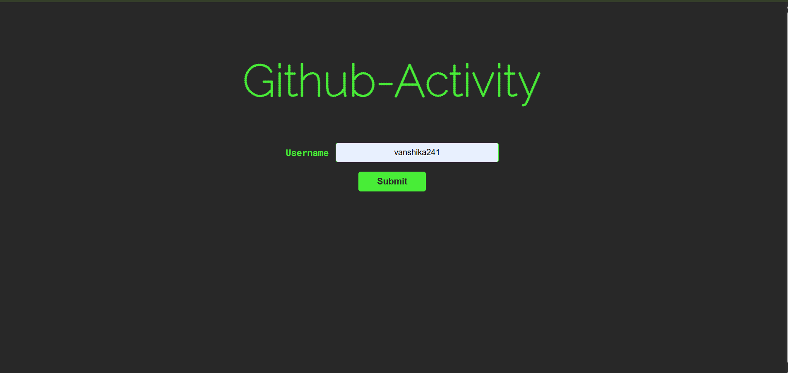

#  GitHub Activity Tracker

---

##  Introduction

**GitHub Activity Tracker** is a full-stack web application that allows users to explore GitHub profiles by simply entering a username.  
It fetches real-time data from the GitHub REST API and displays user profile details, repositories, commit statistics, and recent activity in a clean and developer-friendly interface.

This project demonstrates real-world API integration, secure token handling, and full-stack development using Spring Boot and JavaScript.

---

##  Features

-  Search GitHub users by username  
-  View user profile details (avatar, username, public repositories)  
-  Fetch and display public repositories  
-  Show approximate total commit count  
-  Display recent GitHub activities (Push events, Pull Requests, etc.)  
-  Secure GitHub API access using environment variables  
-  Clean and responsive user interface  

---

##  Tech Stack

### Frontend
- **HTML** – Structure and layout  
- **CSS** – Styling and UI design  
- **JavaScript** – API calls and dynamic content  

### Backend
- **Spring Boot** – REST API development  
- **Java** – Backend logic  

### External API
- **GitHub REST API**
  - User profile data  
  - Repository details  
  - Events and commit statistics  

---

